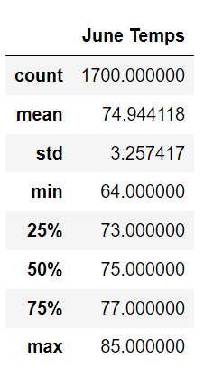
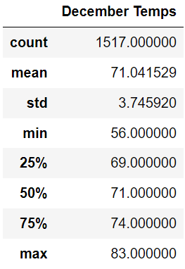

# Analyzing Weather Trends with SQL

<div align="center">
    
</div>

## <div align="center">Use Python and SQL to analyze weather trends to help determine viability of a year-round surf shop in Oahu, Hawaii</div>

<p align="center">
<a href="#goals">Goals</a> &nbsp;&bull;&nbsp;
<a href="#dataset">Dataset</a> &nbsp;&bull;&nbsp;
<a href="#tools-used">Tools Used</a> &nbsp;&bull;&nbsp;
<a href="#analysis-and-challenges">Analysis and Challenges</a> &nbsp;&bull;&nbsp;
<a href="#results">Results</a>
</p>

# <div align="center">Goals</div>

Our good friend lives in Oahu, Hawaii, and needs our help analyzing weather trends to help determine if a surf and ice cream shop is sustainable year-round. We have already analyzed the precipitation level data to show that Oahu is the perfect place for surfers. The next objective is to analyze historical temperature data for June and December in Oahu. Our primary tools will be Jupyter Notebook and the SQLAlchemy depencency, which will enable us to perform the necessary queries for this analysis


# <div align="center">Dataset</div>

We'll be analyzing historical weather data stored locally in a SQLite database

- [Hawaii Weather DB:](data/hawaii.sqlite) SQLite database with two tables: 
    - **Measurement:** 19,550 rows of historical precipitation data
    - **Station:** 9 rows of weather station data

# <div align="center">Tools Used</div>
- **Python:** Programming language used to build automated auditing solution
    - **Matplotlib:** Open source Python library used for graphing and plotting
    - **Pandas:** Open source Python library providing high performance analysis tools
    - **Numpy:** Open source Python library used for advanced scientific computing
    - **SQLAlchemy:** Open source Python library used for querying SQL databases
- **SQL:** Structured Query Language, used to query databases and quickly analyze structured data


# <div align="center">Analysis and Challenges</div>

Utilizing the SQLAlchemy depencency in Jupyter Notebook, we were able to import the data from our hawaii.sqlite file and run the following queries to isolate temperate data from every June and December:


```python
session.query(Measurement.tobs).filter(func.strftime("%m", Measurement.date) == "06").all()
____________________________________________________________________________________________

session.query(Measurement.tobs).filter(func.strftime("%m", Measurement.date) == "12").all()
```

We then transferred the query results into the dataframes below with descriptive data:





- Not surprisingly, the average temperature in June is warmer than December, by about 3 degrees.
- The minimum temperature in December is lower than June in Oahu, by about 8 degrees. Thankfully this is still feasible weather for winter surfing and ice cream.
- There are many more data points for June weather than December, meaning that we're more confident in the predictive power of the historical temperate data for June.

# <div align="center">Results</div>

According to our findings, we think Oahu is a great year round setting for your Surf and Ice Cream Shop. There's isn't a lot of variation in Temperature from June to December, there's plenty of good weather to go around!

We recomment the following queries for further analysis:
- Expand the scope of the precipitation data to the last 5 years to gain additional insight into patterns.
- Use a groupby query to determine which months have the lowest precipitation and highest temperatures to determine peak season for the shop. We might need additional staff for that time of the year!

[Back to top](#analyzing-weather-trends-with-sql)


